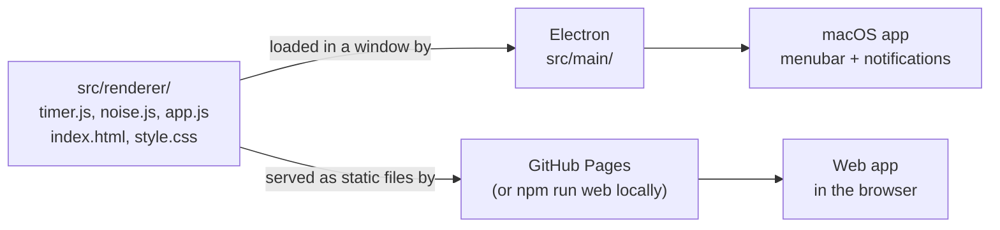
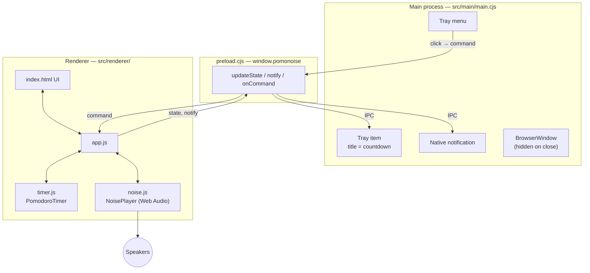
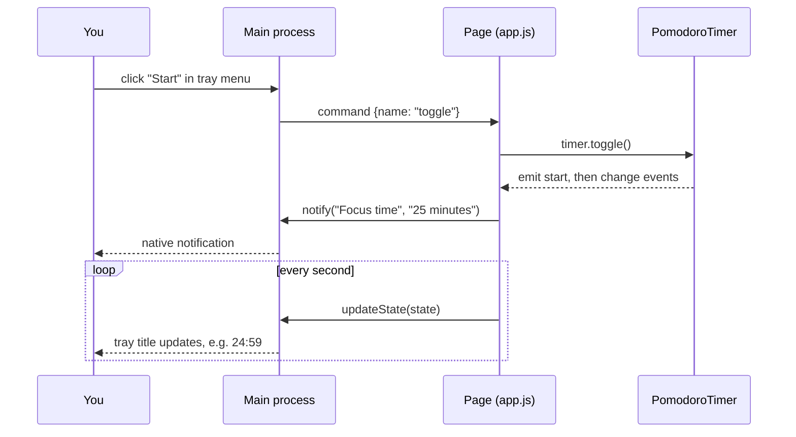
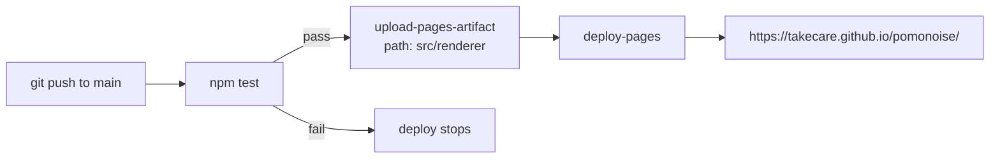
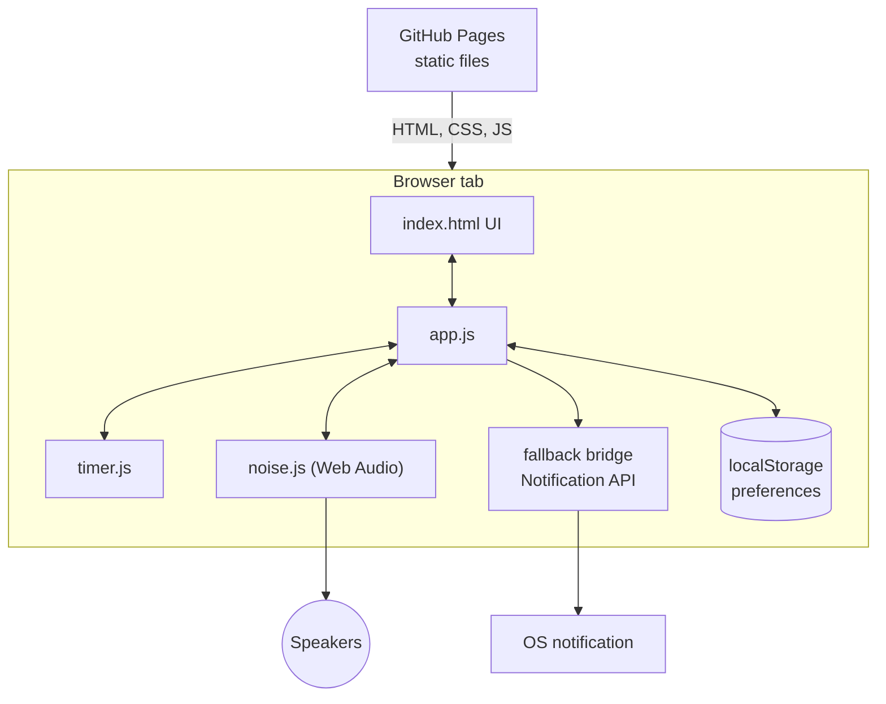

# Pomonoise

A pomodoro timer with a built-in noise generator, living in your macOS menubar.
Inspired by [Tomighty](https://github.com/tomighty/tomighty) (timer) and
[HSL-Noise](https://github.com/MitPitt/HSL-Noise) (noise).

**Web version:** https://takecare.github.io/pomonoise/

## Features

- Pomodoro / short break / long break cycle. Durations are configurable, and a long break comes every N pomodoros.
- White, pink, brown, blue and violet noise, generated live with Web Audio (no audio files).
- Menubar item (macOS app only) showing the countdown, with a menu to start, pause, skip, reset and control the noise.
- System notifications when a phase starts or ends.
- Option to play noise only while focusing.
- Preferences are remembered between sessions.

## Next features

1. **Visualiser**: a live display of the noise, shown in the page, and in the menubar item when it is clicked.
2. **Noise curve**: draw the spectrum (level per frequency) of the noise that is actually playing, so the differences between white, pink, brown, blue and violet can be seen.
3. **Fade-out setting**: a setting that starts fading the noise away when X seconds are left in the current pomodoro.

## Two ways to run it, one codebase

Everything the app does (timer, noise, UI) lives in `src/renderer/`, plain HTML/CSS/JS with no framework and no build step. It runs in two hosts:

| | Desktop app (macOS) | Web app |
|---|---|---|
| Host | Electron | Any browser |
| Menubar item | yes | no |
| Notifications | native macOS, via Electron | browser Notification API (asks permission) |
| Runs with window closed / tab hidden | yes | the tab must stay open; browsers may throttle hidden tabs |
| Distribution | `.app` / `.dmg` you build yourself | GitHub Pages |



## Project layout

```
src/
  renderer/           the app itself (shared by both versions)
    timer.js          pure pomodoro state machine (injected clock, unit-tested)
    noise.js          noise generators (pure) + Web Audio player
    app.js            UI wiring, saved preferences, noise policy, host bridge
    index.html, style.css
  main/               Electron only
    main.cjs          window, menubar (tray) item, native notifications
    preload.cjs       small IPC bridge exposed to the page as window.pomonoise
assets/               menubar template icons (generated by scripts/make-icons.mjs)
scripts/
  serve.mjs           tiny static server for `npm run web`
  make-icons.mjs      generates the tray icon PNGs
test/                 unit tests for the timer and the noise generators
.github/workflows/pages.yml   tests + deploy to GitHub Pages
```

## Building and running the macOS app locally

**Requirements:** macOS, [Node.js](https://nodejs.org/) 22 or newer (includes npm). You do not need Xcode.

```sh
git clone https://github.com/takecare/pomonoise.git
cd pomonoise
npm install
```

**Run it in development:**

```sh
npm start
```

A window opens and a tray item appears in the menubar. Closing the window hides it; the app keeps running in the menubar. Use the menubar menu, "Quit", to exit. The first time a notification is sent, macOS may ask for permission (or you may need to allow it in System Settings → Notifications).

**Build a distributable app:**

```sh
npm run dist
```

This runs `electron-builder --mac` (configured in the `build` section of `package.json`) and writes the result to `dist/`: a `.dmg` and a `.zip` containing `Pomonoise.app`. Drag the app to `/Applications`.

Notes:
- The build is **not code-signed or notarized**. On first launch macOS Gatekeeper may refuse to open it; right-click the app, choose Open, then confirm. Signing needs an Apple Developer account and is not set up.
- Build on the architecture you run on (Apple Silicon or Intel). Cross-building is not configured.
- Run `npm test` first if you changed the timer or noise code.

## How the desktop app works

Electron runs two kinds of process. This app splits responsibilities between them as follows:

- The **renderer** (the page) is the source of truth. It owns the timer and the audio, and it is the only thing that knows the current state.
- The **main process** is a thin view. It shows that state in the menubar, sends native notifications, and forwards menu clicks back to the page.

The page and the main process cannot call each other directly (`contextIsolation` is on). They talk through `preload.cjs`, which exposes three functions as `window.pomonoise`:

| Direction | Call | Purpose |
|---|---|---|
| page → main | `updateState(state)` | after every timer change (about once a second) and every noise change; main redraws the menubar title and menu |
| page → main | `notify(title, body)` | when a phase starts or ends; main shows a native notification |
| main → page | `onCommand(cb)` | menu clicks: `toggle`, `skip`, `reset`, `noise`, `noiseType` |



A menubar click, end to end:



Details worth knowing:
- The window is created with `backgroundThrottling: false` and Electron is started with `autoplay-policy=no-user-gesture-required`, so the timer keeps ticking and noise can start from the menubar while the window is hidden and nothing has been clicked.
- The timer stores an end timestamp and recomputes remaining time on every tick, so a delayed tick never makes it drift.
- Noise is generated in JavaScript into a 12-second stereo buffer per colour (equal-power crossfaded so the loop has no click, loudness-matched between colours) and looped.

## Building and hosting the web app

There is **no build step**. `src/renderer/` is already a static site: only relative paths and no bundler, so it works from any URL, including the `/pomonoise/` subpath on GitHub Pages.

**Run it locally:**

```sh
npm run web          # serves src/renderer at http://localhost:5173 (PORT=8080 npm run web to change)
```

(`npm run web` needs no `npm install`; it only uses Node's standard library.)

**How it is hosted:** GitHub Pages, deployed by `.github/workflows/pages.yml` on every push to `main` (or manually via the Actions tab → "Run workflow").



One-time repository setup (already done for this repo):
1. Settings → Pages → **Source: GitHub Actions**.
2. Settings → Environments → `github-pages` → Deployment branches must allow `main`. Otherwise the deploy fails with "Branch main is not allowed to deploy to github-pages due to environment protection rules".

## How the web app works

The same `app.js` runs, but there is no Electron, so `window.pomonoise` does not exist. `app.js` detects that and uses a fallback bridge:

- `notify` uses the browser `Notification` API. Permission is requested the first time a notification is needed; if it is denied, notifications are silently skipped.
- `updateState` and `onCommand` do nothing, since there is no menubar.



Limitations compared to the desktop app:
- Browsers may throttle timers and audio in background tabs. The countdown stays correct (it is based on timestamps), but the phase-change notification or noise change can arrive late while the tab is hidden.
- Browsers block audio until you interact with the page, so noise cannot start on its own after a fresh page load. Click something first.
- There is no menubar item.
- Preferences live in the browser's `localStorage`, per browser and per site address (so `localhost` and the Pages site keep separate settings).

## Tests

```sh
npm test
```

Runs Node's built-in test runner over `test/*.test.js`. It covers the timer (countdown, pause/resume, phase order, long breaks, skip, reset, settings) and the noise generators (range, loudness, loop seam, and the expected dark-to-bright ordering: brown < pink < white < blue < violet). The Electron shell and audio playback are not covered by automated tests.

## Notes on the tray icon

The menubar icons in `assets/` are simple generated placeholders (`node scripts/make-icons.mjs` regenerates them). They are macOS "template" images (black with transparency), so macOS tints them for light and dark menubars. Replace them with a designed icon whenever you like, keeping the `trayTemplate.png` and `trayTemplate@2x.png` names.
