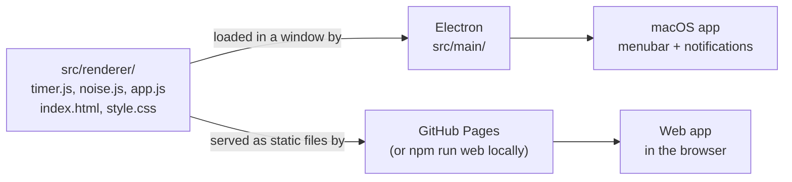
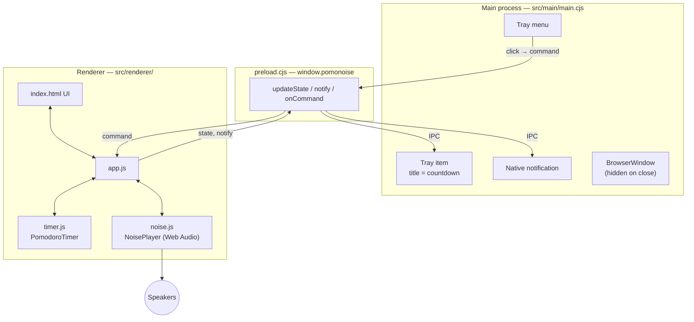
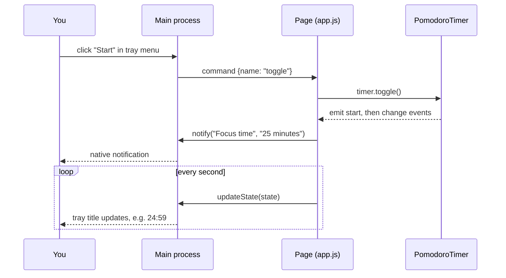
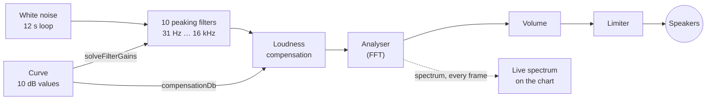
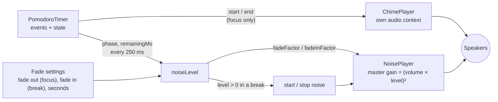
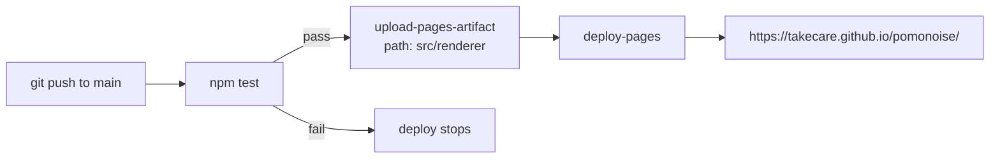
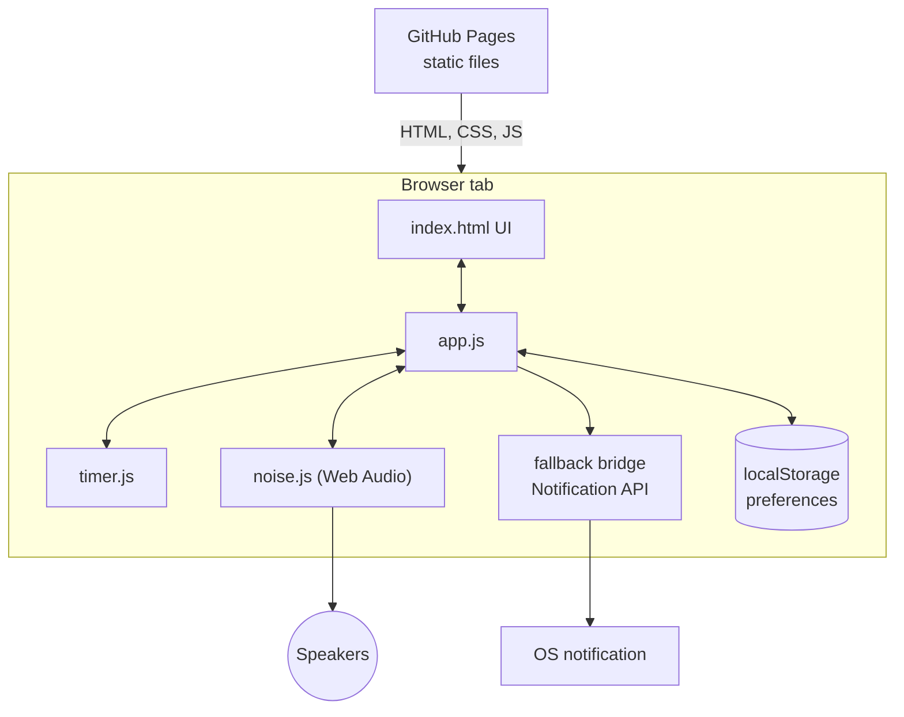

# Pomonoise

A pomodoro timer with a built-in noise generator, living in your macOS menubar.
Inspired by [Tomighty](https://github.com/tomighty/tomighty) (timer) and
[HSL-Noise](https://github.com/MitPitt/HSL-Noise) (noise).

**Web version:** https://takecare.github.io/pomonoise/

## Features

- Pomodoro / short break / long break cycle. Durations are configurable, and a long break comes every N pomodoros.
- Noise generated live with Web Audio (no audio files). The sound is defined by a **curve**: drag ten coloured points (31 Hz to 16 kHz, ±30 dB) to shape it. White, pink, brown, blue and violet are presets of that curve.
- Live spectrum: the measured spectrum of what is actually playing, drawn over the curve.
- Menubar item (macOS app only) showing the countdown, with a menu to start, pause, skip, stop and control the noise.
- System notifications when a phase starts or ends.
- Option to play noise only while focusing.
- Generated chimes (no audio files): a rising two-note chime when a focus session starts and a falling three-note one when it ends. Each can be switched off separately.
- Fades (two separate switches, one shared duration, 30 s by default, both off by default): the noise can **fade out** over the last X seconds of a focus session, and it can **fade in** over the last X seconds of a break, staying silent for the rest of the break so it arrives just as focus begins.
- Light and dark themes. By default the app follows the system setting live; Settings → Appearance → Theme can force Light or Dark.
- Preferences are remembered between sessions.

## Next features

1. **Menubar visualiser**: show the curve and live spectrum when the menubar item is clicked. Native macOS menus cannot draw a canvas, so this means opening a small popover window under the icon and streaming the spectrum to it.
2. Possible follow-ups: free-hand curve drawing, saving named custom curves, a separate chime volume.

## Two ways to run it, one codebase

Everything the app does (timer, noise, UI) lives in `src/renderer/`, plain HTML/CSS/JS with no framework and no build step. It runs in two hosts:

| | Desktop app (macOS) | Web app |
|---|---|---|
| Host | Electron | Any browser |
| Menubar item | yes | no |
| Notifications | native macOS, via Electron | browser Notification API (asks permission) |
| Runs with window closed / tab hidden | yes | the tab must stay open; browsers may throttle hidden tabs |
| Distribution | `.app` / `.dmg` you build yourself | GitHub Pages |



## Project layout

```
src/
  renderer/           the app itself (shared by both versions)
    timer.js          pure pomodoro state machine (injected clock, unit-tested)
    eq.js             the noise curve: presets, biquad maths, filter solver (pure, unit-tested)
    spectrum.js       FFT bins -> smoothed log-frequency curve (pure, unit-tested)
    noise.js          white-noise generator (pure) + Web Audio player (filter chain, analyser, fade)
    fade.js           fade-out / fade-in curves (pure, unit-tested)
    theme.js          theme names and applying the data-theme override (pure, unit-tested)
    theme-init.js     tiny pre-paint script so a saved theme override doesn't flash
    chime.js          chime definitions (pure) + synthesis and player
    eq-editor.js      canvas widget: draggable curve points + live spectrum overlay
    app.js            UI wiring, saved preferences, noise policy, host bridge
    index.html, style.css
    favicon.svg, favicon-32.png, apple-touch-icon.png   site icons (see below)
  main/               Electron only
    main.cjs          window, menubar (tray) item, native notifications
    preload.cjs       small IPC bridge exposed to the page as window.pomonoise
assets/               menubar template icons (generated by scripts/make-icons.mjs)
scripts/
  serve.mjs           tiny static server for `npm run web`
  make-icons.mjs      generates the tray icon PNGs
test/                 unit tests for the timer and the noise generators
.github/workflows/pages.yml   tests + deploy to GitHub Pages
```

## Building and running the macOS app locally

**Requirements:** macOS, [Node.js](https://nodejs.org/) 22 or newer (includes npm). You do not need Xcode.

```sh
git clone https://github.com/takecare/pomonoise.git
cd pomonoise
npm install
```

**Run it in development:**

```sh
npm start
```

A window opens and a tray item appears in the menubar. Closing the window hides it; the app keeps running in the menubar. Use the menubar menu, "Quit", to exit. The first time a notification is sent, macOS may ask for permission (or you may need to allow it in System Settings → Notifications).

**Build a distributable app:**

```sh
npm run dist
```

This runs `electron-builder --mac` (configured in the `build` section of `package.json`) and writes the result to `dist/`: a `.dmg` and a `.zip` containing `Pomonoise.app`. Drag the app to `/Applications`.

Notes:
- The build is **not code-signed or notarized**. On first launch macOS Gatekeeper may refuse to open it; right-click the app, choose Open, then confirm. Signing needs an Apple Developer account and is not set up.
- Build on the architecture you run on (Apple Silicon or Intel). Cross-building is not configured.
- Run `npm test` first if you changed the timer or noise code.

## How the desktop app works

Electron runs two kinds of process. This app splits responsibilities between them as follows:

- The **renderer** (the page) is the source of truth. It owns the timer and the audio, and it is the only thing that knows the current state.
- The **main process** is a thin view. It shows that state in the menubar, sends native notifications, and forwards menu clicks back to the page.

The page and the main process cannot call each other directly (`contextIsolation` is on). They talk through `preload.cjs`, which exposes three functions as `window.pomonoise`:

| Direction | Call | Purpose |
|---|---|---|
| page → main | `updateState(state)` | after every timer change (about once a second) and every noise change; main redraws the menubar title and menu |
| page → main | `notify(title, body)` | when a phase starts or ends; main shows a native notification |
| page → main | `setTheme(theme)` | when the Theme setting changes (and at startup); main sets `nativeTheme.themeSource` so the window frame follows |
| main → page | `onCommand(cb)` | menu clicks: `toggle`, `skip`, `reset`, `noise`, `noiseType` |



A menubar click, end to end:



Details worth knowing:
- The window is created with `backgroundThrottling: false` and Electron is started with `autoplay-policy=no-user-gesture-required`, so the timer keeps ticking and noise can start from the menubar while the window is hidden and nothing has been clicked.
- The timer stores an end timestamp and recomputes remaining time on every tick, so a delayed tick never makes it drift.
- The noise source is one 12-second stereo white-noise buffer (equal-power crossfaded so the loop has no click), looped. See "How the noise works" below.

## How the noise works

Every colour of noise is white noise with a different **spectral slope**: pink falls 3 dB per octave, brown 6, blue rises 3, violet 6. So the app generates white noise once and shapes it with an EQ curve; the presets are just curves.



- **The curve** is ten numbers: the wanted level in dB, relative to white noise, at 31, 62, 125 … 16000 Hz (each −30 to +30). Presets are `slope × octaves` around the middle of the range (`presetCurve` in `eq.js`).
- **Filters:** one peaking biquad per band. Neighbouring filters overlap, so setting each filter's gain to its own target would overshoot. `solveFilterGains` iterates until the combined response passes through every target point. The chart draws that combined response (computed with the same formulas the browser uses), so the line you see is the sound you get.
- **Why not shelving filters at the ends?** A shelf holds its gain all the way down to 0 Hz. A steep curve like brown would then put huge amounts of inaudible sub-bass energy in the signal, and the loudness compensation would make the audible part far too quiet. Peaking filters roll off outside the outer bands. The trade-off: on steep curves the line sags slightly between the last two points and rises again beyond 16 kHz.
- **Smoothness:** the filters are wide (Q 0.8, about 1.7 octaves) so a slope comes out straight. The flip side is that a smooth EQ cannot follow a sharp zig-zag; the handle then sits on the line, not exactly where you dragged.
- **Loudness compensation:** after the filters a gain is applied so every curve has the same overall loudness as flat white noise. Without it, boosting bands would just make things louder. A limiter guards against clipping.
- **Live spectrum:** an `AnalyserNode` after the compensation (so the volume slider does not move the picture) is read every frame. `spectrum.js` averages FFT bins over a third of an octave and smooths over time. Absolute FFT levels aren't meaningful, so the measured line is aligned to the curve by average level: you compare shape, not height. It is only drawn while the window is visible.

Measured in Chromium with the real audio graph, the played spectrum follows the target curve of each preset to within about 1 dB (0.2 dB on average) between 50 Hz and 12 kHz.

## How chimes and fade-out work

Both are driven by the timer's events and state in `app.js`; neither touches the timer logic.

**Chimes** are synthesised, not recorded. Each note is three sine partials at inharmonic ratios (1 : 2.76 : 5.4, roughly a small bell) with an instant attack and an exponential decay; higher partials die away faster. `chime.js` holds the notes as data (`chimeNotes`, unit-tested) and schedules oscillators on the Web Audio clock. The chimes have their own audio context and a fixed level; they do not go through the noise curve or the volume slider, so they are audible even when the noise is off or turned down. In Settings, "Play" previews each one.

| Event | Chime |
|---|---|
| a focus session starts | E5 → B5, short and rising |
| a focus session ends | G5 → E5 → C5, longer and falling |

Break phases never chime; the desktop notification still fires for every phase.

**Fades** multiply the volume slider by a level between 0 and 1 that depends on the time left in the current phase and on `fadeSeconds` (`fade.js`):

| Phase | Switch | Level |
|---|---|---|
| focus | "Fade out at the end of a focus session" | 1 until `fadeSeconds` are left, then a straight line down to 0 at 00:00 (`fadeFactor`) |
| break | "Fade in at the end of a break" | 0 (silent) until `fadeSeconds` are left, then a straight line up to 1 at 00:00 (`fadeInFactor`) |

Because the slider maps to gain squared, both fades change steadily in perceived loudness (halfway through, the level is −12 dB). The level is applied every 250 ms with a short smoothing constant, so there are no audible steps. While the timer is paused or idle the level simply holds.

With "Fade in at the end of a break" on, the break is silent until the fade window opens, so the noise is only started at that point (the fade-in takes precedence over "Only play while focusing", otherwise you would never hear it). Together with the focus fade-out this gives a full cycle: fade out, quiet break, fade in, focus. With the fade-in off, a break behaves as before: the noise follows the noise on/off switch and "Only play while focusing".



## How the theme works

The default is to follow the system: `style.css` defines the light palette on `:root` and swaps to the dark one under `@media (prefers-color-scheme: dark)`, so it changes live when the OS does. The Theme setting adds an override on top: choosing Light or Dark sets `data-theme="light"` or `"dark"` on `<html>`, and choosing Follow system removes the attribute. In CSS the override wins over the media query.

- **No flash:** `theme-init.js` is a small classic script in `<head>` (inline scripts are not allowed by the app's Content-Security-Policy) that applies a saved override before the first paint.
- **The curve chart** is drawn on a canvas, which does not follow CSS by itself. It reads the colour variables each time it draws, and redraws when `data-theme` changes or the OS scheme changes.
- **Desktop app:** the page also tells the main process, which sets Electron's `nativeTheme.themeSource`, so the window frame and Chromium's own idea of the colour scheme agree with the setting. This part is untested (no macOS here).
- The dark palette appears twice in the CSS (once for the media query, once for the attribute) because CSS cannot share one rule between the two.

## Building and hosting the web app

There is **no build step**. `src/renderer/` is already a static site: only relative paths and no bundler, so it works from any URL, including the `/pomonoise/` subpath on GitHub Pages.

**Run it locally:**

```sh
npm run web          # serves src/renderer at http://localhost:5173 (PORT=8080 npm run web to change)
```

(`npm run web` needs no `npm install`; it only uses Node's standard library.)

**How it is hosted:** GitHub Pages, deployed by `.github/workflows/pages.yml` on every push to `main` (or manually via the Actions tab → "Run workflow").



One-time repository setup (already done for this repo):
1. Settings → Pages → **Source: GitHub Actions**.
2. Settings → Environments → `github-pages` → Deployment branches must allow `main`. Otherwise the deploy fails with "Branch main is not allowed to deploy to github-pages due to environment protection rules".

## How the web app works

The same `app.js` runs, but there is no Electron, so `window.pomonoise` does not exist. `app.js` detects that and uses a fallback bridge:

- `notify` uses the browser `Notification` API. Permission is requested the first time a notification is needed; if it is denied, notifications are silently skipped.
- `updateState` and `onCommand` do nothing, since there is no menubar.



Limitations compared to the desktop app:
- Browsers may throttle timers and audio in background tabs. The countdown stays correct (it is based on timestamps), but the phase-change notification or noise change can arrive late while the tab is hidden.
- Browsers block audio until you interact with the page, so noise cannot start on its own after a fresh page load. Click something first.
- There is no menubar item.
- Preferences live in the browser's `localStorage`, per browser and per site address (so `localhost` and the Pages site keep separate settings).

## Tests

```sh
npm test
```

Runs Node's built-in test runner over `test/*.test.js`. It covers:
- the timer (countdown, pause/resume, phase order, long breaks, skip, reset, settings);
- the white-noise generator (range, loudness, loop seam, flatness);
- the fade-out and fade-in curves and the chime definitions;
- theme selection (`normalizeTheme`, `applyTheme`);
- the curve maths (preset slopes, preset matching, the filter solver hitting its target points, straight slopes between points, loudness compensation);
- spectrum smoothing and alignment.

The Electron shell, the audio graph, the chime synthesis and the canvas editor are not covered by automated tests; they were checked manually in Chromium (including a fake-clock run that fast-forwards through a focus session to check chimes and fades trigger at the right moments, including the silent break and the rising fade-in; the theme was checked for every combination of OS scheme and setting, live switching, persistence and no flash).

## Icons

- **Site icon:** `src/renderer/favicon.svg` (a red stopwatch). It scales to any size and is what modern browsers use. `favicon-32.png` is the fallback for browsers without SVG favicon support, and `apple-touch-icon.png` (180×180, full-bleed because iOS rounds the corners itself) is used when the page is added to an iOS home screen. The PNGs were rendered from the SVG; if you change the SVG, re-render them.
- **The desktop app's own icon** (Dock, Finder) is not set yet: `npm run dist` builds with Electron's default icon.

## Notes on the tray icon

The menubar icons in `assets/` are simple generated placeholders (`node scripts/make-icons.mjs` regenerates them). They are macOS "template" images (black with transparency), so macOS tints them for light and dark menubars. Replace them with a designed icon whenever you like, keeping the `trayTemplate.png` and `trayTemplate@2x.png` names.
